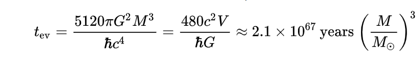

# Infinity and Black Holes
In this exercise, we will be looking at black holes and their behaviour after a long time. You will get to learn about black holes in general, information theory, and basic laws of our universe. You will also get a chance to simulate how our basic laws can be broken at extreme cases.
## Learning Objectives
1. Get acquainted with descriptions of a black hole, its structures and behaviour'
2. Visualize how the black hole changes over time
3. Discuss the information theory, mass conservation laws and enegery conservation laws considering black hole evaporation

## Background Information
Black holes grow by absorbing matter from their surroundings. They 'eat' stars and other bodies that come too close, and as the matter falls into the black hole, it forms an accretion disk around it. The matter in the disk heats up and emits radiation, which can be detected by astronomers. The more matter a black hole absorbs, the bigger it gets and the stronger its gravitational pull becomes. This gravitational pull can be so strong that even light cannot escape from it, which is why black holes are called 'black'.

[Hawking radiation](https://en.wikipedia.org/wiki/Hawking_radiation) is a theoretical form of radiation emitted by black holes. According to the theory, black holes emit particles in pairs, with one particle escaping the black hole's gravity and the other being absorbed by the black hole. The particle that escapes is called Hawking radiation.
 

Over time, this radiation causes black holes to lose mass and energy, and as a result, they shrink and eventually decay. The rate of decay is dependent on the black hole's mass, with smaller black holes decaying faster than larger ones.
 

It is important to note that the existence of Hawking radiation has not been directly observed, but its effects have been indirectly inferred through observations of black holes and theoretical calculations. The time for the evaporation of a black hole is given by the following equation:

## Assignment
The assignment is simple. We will be calculating the necessary time for a set of black holes to decay. We will assume that there exist a black hole that is the same mass as the Earth, Jupiter, the Sun, Sagittarius A* (the black hole at the center of our galaxy) and Phoenix A (the most massive black hole ever discovered). 
```
A fun fact about Phoenix A is that it is twice the size of the Triangulum galaxy and that it has a a circumference that would take 71 days and 14 hours to travel at light speed.
```

Please take a look at [instructions.md](instructions.md).
  